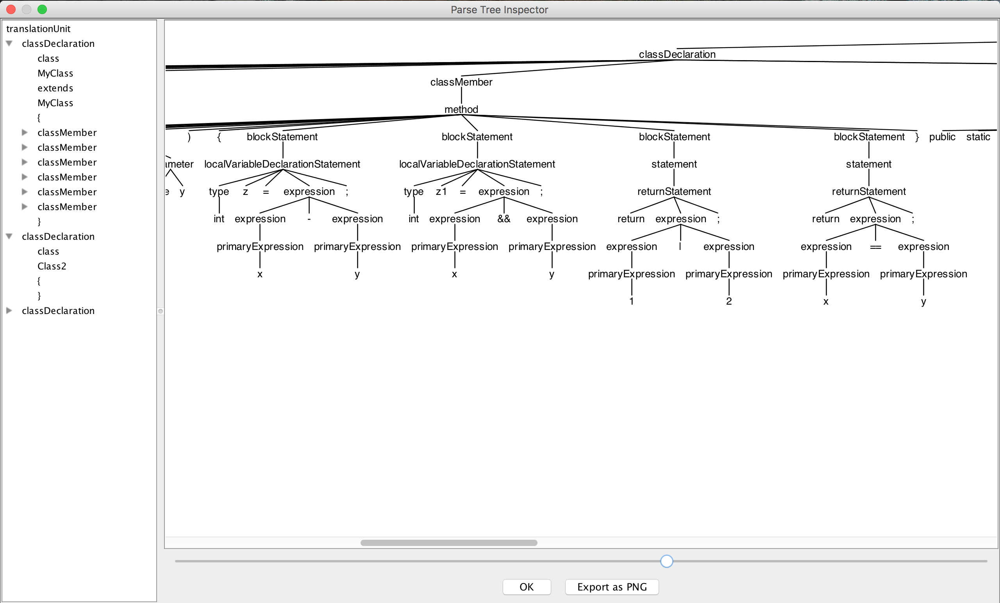

# MiniJava
Compilers course project - MiniJava front-end compiler

## Introduction 介绍

利用[ANTLR4](http://www.antlr.org/)工具，为MiniJava语言构造一个简易的编译器前端，将输入转化为抽象语法树，并进行一定的语义检查。

### Grammar 语法

参考[Christoph Mallon, Jo ̈rg Herter. *MiniJava Language Specification*, October 21, 2009.](miniJava%2Blangspec.pdf)

### Functions 功能
* 词法分析
* 语法分析
* 抽象语法树GUI
* 出错位置和类型提示
* 标识符定义检查——是否使用未定义标识符，是否重复定义标识符等
* 方法调用参数检查
* 方法返回类型检查
* 标识符类型检查
* 运算类型检查

### Grammar Description 语法描述

[**MiniJava.g4**](src/main/resources/MiniJava.g4)

```java
grammar MiniJava;

translationUnit
    :   classDeclaration*
    ;

classDeclaration
    :   'class' IDENTIFIER ('extends' IDENTIFIER)? '{' classMember* '}'
    ;

classMember
    :   field
    |   mainMethod
    |   method
    ;

field
    :   'public' type IDENTIFIER ';'
    ;

mainMethod
    :   'public' 'static' 'void' 'main' '(' 'String' '[' ']' IDENTIFIER ')' '{' blockStatement* '}'
    ;

method
    :   'public' type IDENTIFIER '(' parameters? ')' '{' blockStatement* '}'
    ;

parameters
    :   parameter (',' parameter)*
    ;

parameter
    :   type IDENTIFIER
    ;

type
    :   'boolean'
    |   'int'
    |   'void'
    |   IDENTIFIER
    ;

statement
    :   block
    |   printStatement
    |   ifStatement
    |   whileStatement
    |   emptyStatement
    |   expressionStatement
    |   returnStatement
    ;

block
    :   '{' blockStatement* '}'
    ;

ifStatement
    :   'if' '(' expression ')' statement ('else' statement)?
    ;

whileStatement
    :   'while' '(' expression ')' statement
    ;

emptyStatement
    :   ';'
    ;

printStatement
    :   'System' '.' 'out' '.' 'println' '(' expression ')' ';'
    ;

expressionStatement
    :   expression ';'
    ;

returnStatement
    :   'return' expression? ';'
    ;

blockStatement
    :   statement
    |   localVariableDeclarationStatement
    ;

localVariableDeclarationStatement
    :   type IDENTIFIER ('=' expression)? ';'
    ;

expression
    :   primaryExpression
    |   expression '.' IDENTIFIER '(' expressionList? ')'
    |   expression '.' IDENTIFIER
    |   'new' IDENTIFIER '(' ')'
    |   ('-'|'!') expression
    |   expression ('*' | '/' | '%') expression
    |   expression ('+' | '-') expression
    |   expression ('<=' | '>=' | '>' | '<') expression
    |   expression ('==' | '!=') expression
    |   expression '&' expression
    |   expression '|' expression
    |   expression '&&' expression
    |   expression '||' expression
    |   expression '='<assoc=right> expression
    ;

primaryExpression
    :   '(' expression ')'
    |   'this'
    |   'null'
    |   'false'
    |   'true'
    |   INTEGER
    |   IDENTIFIER '(' expressionList? ')'
    |   IDENTIFIER
    ;

expressionList
    :   expression (',' expression)*
    ;

INTEGER
    :   [1-9] DIGIT*
    ;

IDENTIFIER
    :   LETTER (LETTER | JAVAIDDIGIT)*
    ;

fragment
LETTER
    :   '\u0024'
    |   '\u0041'..'\u005a'
    |   '\u005f'
    |   '\u0061'..'\u007a'
    |   '\u00c0'..'\u00d6'
    |   '\u00d8'..'\u00f6'
    |   '\u00f8'..'\u00ff'
    |   '\u0100'..'\u1fff'
    |   '\u3040'..'\u318f'
    |   '\u3300'..'\u337f'
    |   '\u3400'..'\u3d2d'
    |   '\u4e00'..'\u9fff'
    |   '\uf900'..'\ufaff'
    ;

fragment
JAVAIDDIGIT
    :   '\u0030'..'\u0039'
    |   '\u0660'..'\u0669'
    |   '\u06f0'..'\u06f9'
    |   '\u0966'..'\u096f'
    |   '\u09e6'..'\u09ef'
    |   '\u0a66'..'\u0a6f'
    |   '\u0ae6'..'\u0aef'
    |   '\u0b66'..'\u0b6f'
    |   '\u0be7'..'\u0bef'
    |   '\u0c66'..'\u0c6f'
    |   '\u0ce6'..'\u0cef'
    |   '\u0d66'..'\u0d6f'
    |   '\u0e50'..'\u0e59'
    |   '\u0ed0'..'\u0ed9'
    |   '\u1040'..'\u1049'
    ;

fragment
DIGIT
    :   [0-9]
    ;

LINE_COMMENT
    :   '//' .*? '\r'? '\n' -> channel(HIDDEN)
    ;

COMMENT
    :   '/*' .*? '*/' -> channel(HIDDEN)
    ;

WS
    :   [ \t\r\u000C\n]+ -> channel(HIDDEN)
    ;
```

## Manual 软件说明

### Environment 环境

* JDK 1.6
* Apache Maven 3.0.5

### Compile 编译

`mvn clean package assembly:single`

### Run 运行

`java -jar MiniJava-1.0-SNAPSHOT-jar-with-dependencies.jar [options...] files...`

### Arguments 参数

```
 java -jar {jarFile} [options...] files...
 VAL       : code sources
 -gui      : show abstract syntax tree (default: false)
 -rule VAL : start rule (default: translationUnit)
```

## Sample 运行样例

### Command 命令

`java -jar MiniJava-1.0-jar-with-dependencies.jar –gui sample.txt`

### Input 输入

**sample.txt**

```java
class MyClass extends MyClass {

    public int v1;
    public int v1;

    public void method1() { }
    public int method1() { }
    
    public boolean equal(int x, int y) {
        int z = x - y;
        int z1 = x && y;
        return 1 | 2;
        return x == y;
    }

    public static void main(String[] args) {
        a = 1;
        method0(a);
        int b = 3;
        v1();
        method1();
        int eq0 = equal(1, 2);
        boolean eq1 = equal(true, false);
        boolean eq2 = equal(1, 1);
        Class2 c20 = new Class2();
        Class2 c21 = null;
        Class2 c22 = new MyClass();
        Class2 c23 = false;
        method1(b);
    }
}

class Class2 { }
class Class2 { }
```
### Output 输出

```sh
============== Analyzing '/Users/Yuanzi/Documents/project/MiniJava/src/main/resources/sample.txt' ......
line 1:22       class 'MyClass' not found
class MyClass extends MyClass {
                      ^
line 4:15       field 'v1' is already defined before
    public int v1;
               ^
line 7:15       method 'method1' is already defined before
    public int method1() { }
               ^
line 11:17      'x' is supposed to be a(n) boolean value but not a(n) int value
        int z1 = x && y;
                 ^
line 11:22      'y' is supposed to be a(n) boolean value but not a(n) int value
        int z1 = x && y;
                      ^
line 12:15      return type should be boolean
        return 1 | 2;
               ^
line 17:8       variable 'a' not found
        a = 1;
        ^
line 18:8       method 'method0' not found
        method0(a);
        ^
line 18:16      variable 'a' not found
        method0(a);
                ^
line 20:8       'v1' is not a method but a variable
        v1();
        ^
line 22:18      'equal(1,2)' is supposed to be a(n) int value but not a(n) boolean value
        int eq0 = equal(1, 2);
                  ^
line 23:28      'true' is supposed to be a(n) int value but not a(n) boolean value
        boolean eq1 = equal(true, false);
                            ^
line 23:34      'false' is supposed to be a(n) int value but not a(n) boolean value
        boolean eq1 = equal(true, false);
                                  ^
line 27:21      'newMyClass()' is supposed to be a(n) Class2 value but not a(n) MyClass value
        Class2 c22 = new MyClass();
                     ^
line 28:21      'false' is supposed to be a(n) Class2 value but not a(n) boolean value
        Class2 c23 = false;
                     ^
line 29:8       method 'method1' requires 0 parameter(s)
        method1(b);
        ^
line 34:6       class 'Class2' is already defined before
class Class2 { }
      ^
============== Done.
```

### GUI


